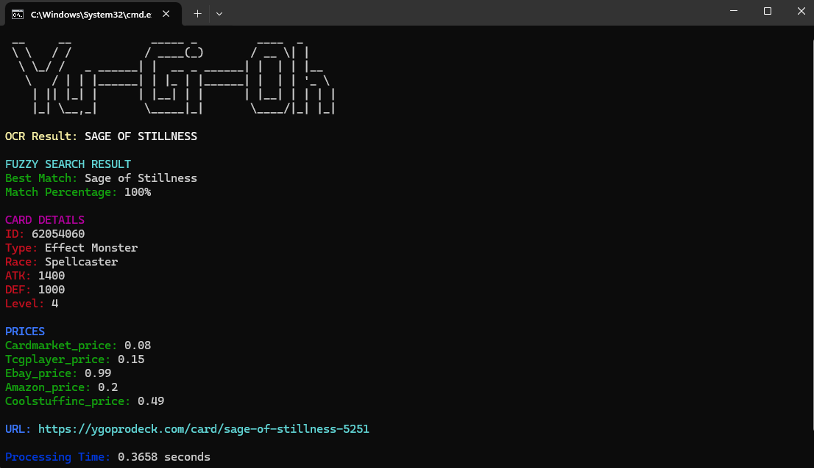

# Card Recognition and Pricing Application

This project is a comprehensive system for recognizing trading cards and retrieving pricing information from various sources. The application consists of two main components:

1. **Database Creation**: A script to create and populate a SQLite database with card information from an online API.
2. **Web Application**: A Flask-based web application that allows users to upload images of cards, perform OCR to identify the card, and retrieve detailed information and prices from the database.

## Project Structure

- **`getdb.py`**: Script that creates the SQLite database `ygoprodeck.db`, fetches card data from the YGOPRODeck API, and stores it in the database.
- **`app.py`**: The main application file that provides a web interface to upload card images, perform OCR, and display the results including card details and prices.

## Features

### 1. Database Creation

- **API Integration**: The script fetches all card data from the YGOPRODeck API.
- **SQLite Database**: A new SQLite database `ygoprodeck.db` is created (if it doesn't already exist), and all card data is stored in a structured table.
- **Data Storage**: Card attributes like name, type, description, attack, defense, level, prices, and more are stored. The entire JSON response for each card is also saved for future reference.

### 2. Web Application

- **OCR using EasyOCR**: Extracts text from card images using a pre-trained OCR model.
- **Fuzzy Matching**: Utilizes fuzzy string matching to find the best match for the OCR result in the database.
- **Pricing Data**: Displays prices from various sources including Cardmarket, TCGPlayer, eBay, Amazon, and CoolStuffInc.
- **Terminal Output**: Displays the results in a formatted and colorful terminal output.
- **Error Handling**: Gracefully handles errors and displays meaningful messages.

## Setup and Installation

### Prerequisites

Make sure you have Python installed. You will also need to install the required Python packages, which are listed below.

### Installation

1. **Clone the repository**:

    ```bash
    git clone https://github.com/freibergs/Yugioh-Card-Scanner
    cd card-recognition-app
    ```

2. **Install the required packages**:

    ```bash
    pip install requirements.txt
    ```

3. **Create the database and populate it with card data**:

    Run the `getdb.py` script to create and populate the SQLite database with card data from the YGOPRODeck API.

    ```bash
    python getdb.py
    ```

4. **Run the web application**:

    Start the Flask server using the following command:

    ```bash
    python app.py
    ```

5. **Access the Application**:

    Open your web browser on a mobile device and navigate to `http://{your_pc_local_ip}:5000`. You can now upload a card image and get detailed information along with pricing.

## Usage

1. **Database Creation**: 

    The `getdb.py` script will remove any existing `ygoprodeck.db` file and create a fresh database. It will then fetch all available card data from the YGOPRODeck API and insert it into the database.

2. **Web Application**: 

    Once the database is set up, run the `app.py` script. Use the web interface to upload card images. The application will perform OCR, search the database for the best match, and display the card details, including prices from various platforms.

## Error Handling

- If the OCR result does not match any card with sufficient accuracy, an error message will be displayed.
- Any unexpected errors during processing will be caught and logged.

## Screenshots

- **Terminal interface** 

   

- **Mobile interface** 

   

## License

This project is licensed under the MIT License. See the [LICENSE](LICENSE.md) file for details.

## Acknowledgements

- [YGOPRODeck API](https://db.ygoprodeck.com/api-guide/) for providing the card data.
- [EasyOCR](https://github.com/JaidedAI/EasyOCR) for the OCR functionality.
- [FuzzyWuzzy](https://github.com/seatgeek/fuzzywuzzy) for string matching.
- [Colorama](https://pypi.org/project/colorama/) for colored terminal output.
